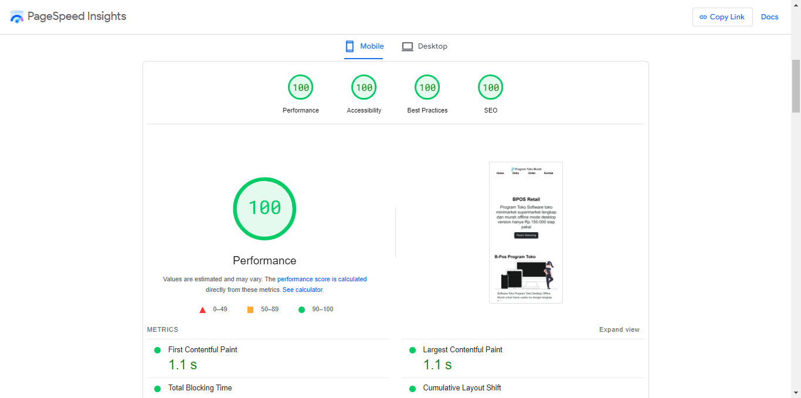
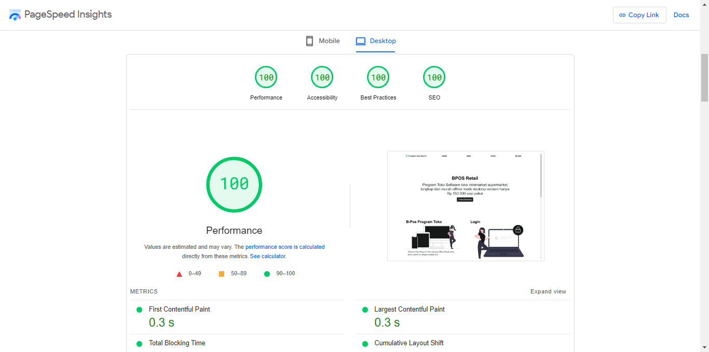
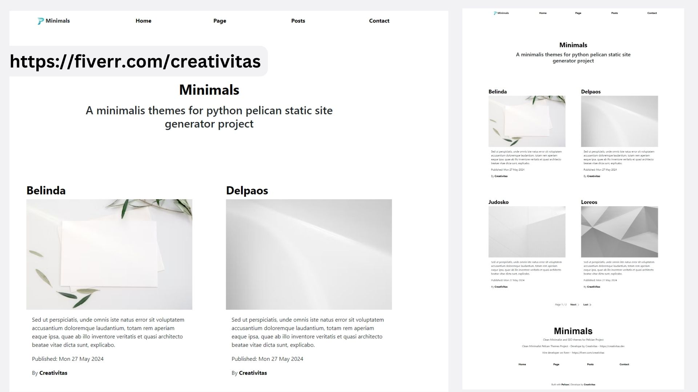
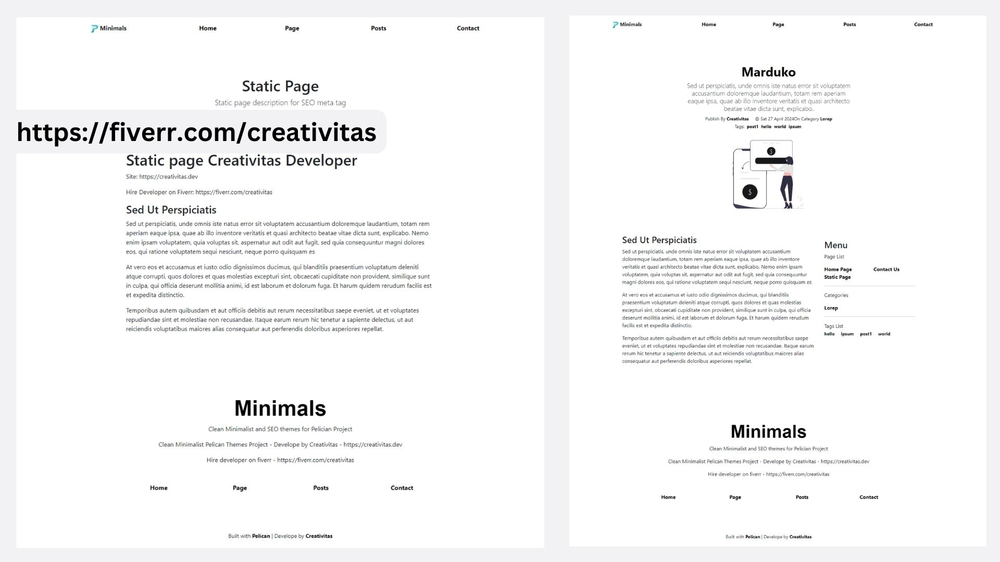
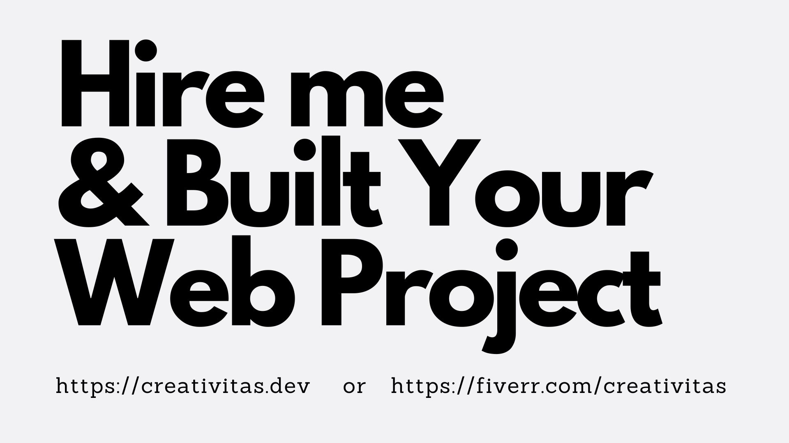

# 🌟 Minimals

## A Clean Minimalist 🦅 Pelican Themes Project

A Project by 👩‍🚀 [Creativitas](https://creativitas.dev)

Read 🛠️ Documentation [https://www.hockeycomputindo.com/themes/pelician/minimals-new-pelican-seo-themes/](https://www.hockeycomputindo.com/themes/pelician/minimals-new-pelican-seo-themes/)

Run Demo for ✍️ Blog Site : [https://youtu.be/BrtpUDFYMV0](https://youtu.be/BrtpUDFYMV0)

Run Demo for 📖 Documentation Site : [https://www.hockeycomputindo.com/dokumentasi/programtokomurah/](https://www.hockeycomputindo.com/dokumentasi/programtokomurah/)

Hire Developer [👉 Hire me →](https://www.hockeycomputindo.com/en/jamstack/)

---

### [🚀 Become a Sponsor](https://github.com/sponsors/mesinkasir) | [☕ Buy me Coffee](https://www.paypal.com/cgi-bin/webscr?cmd=_s-xclick&hosted_button_id=JVZVXBC4N9DAN)

---

### Features 🤹

+ Python Tech
+ Pelican SSG
+ Markdown Content
+ Config Files
+ Clean Minimalist Design
+ Home Page
+ Static Page
+ Blog Page List
+ Blog Detail Post
+ Categories
+ Tags
+ Authors
+ Meta Tag
+ Open Graph 
+ Twitter Card
+ Sitemap.xml Ready
+ Robtos.txt Ready
+ Fast Site

---

### Test Peform 🛰️

Mobile Version

Desktop Version

---

### Design UI 🎨

The Home Page

Post and Page

Need help for your project ?? Hire Me

---

### How to 👀

Open your pelican project , or create new project `pelican-quickstart`

next install markdown for pelican `py -m pip install "pelican[markdown]`

Opne your project `mkdir themes` 

clone this repo `git clone https://github.com/mesinkasir/minimals-pl.git`

open `pelicanconf.py ` and change themes to be `minimals-pl`

Or you can simply open the `static/example-content` folder And copy the `pelicanconf.py` file.

For detail installation and Documentation you can see on our doc site [https://www.hockeycomputindo.com/themes/pelician/minimals-new-pelican-seo-themes/](https://www.hockeycomputindo.com/themes/pelician/minimals-new-pelican-seo-themes/)

---

### [🚀 Become a Sponsor](https://github.com/sponsors/mesinkasir) | [☕ Buy me Coffee](https://www.paypal.com/cgi-bin/webscr?cmd=_s-xclick&hosted_button_id=JVZVXBC4N9DAN)
